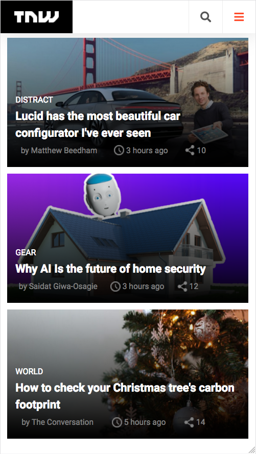

# Project 2: Responsive clone of TNW

> A clone of The Next Web website using media queries and responsive, mobile-first design.

This project is a responsive copy of the The Next Web website. It uses responsive elements such as CSS grid, flexbox and floats. The site scales well with resolution, but it also contains 3 media queries to adapt better to different screen sizes.

## Built With

- CSS3
- HTML4
- Node.js (for Linters and GULP)

## Live Demo

[Live Demo Link](https://notengobattery.github.io/project-2)

## Getting Started

For this project, you do not need to do anything. You can see the project working inside the Live Demo link above. Anyway, if you want a local copy of this project you can clone it using `git` and run it in your browser by opening the `index.html` file.

## Authors

👤 **Oever González**

- GitHub: [@NoTengoBattery](https://github.com/NoTengoBattery)
- Twitter: [@NoTengoBattery](https://twitter.com/NoTengoBattery)
- LinkedIn: [LinkedIn](https://www.linkedin.com/in/jos%C3%A9-oever-gonz%C3%A1lez-hern%C3%A1ndez-7b822a1b6/)

👤 **Luis Vinicius**

- GitHub: [@luisvinicius09](https://github.com/luisvinicius09)
- Twitter: [@luisvinicius09](https://twitter.com/luisvinicius09)
- LinkedIn: [LinkedIn](https://www.linkedin.com/in/luis-vinicius)

## 🤝 Contributing

Contributions, issues, and feature requests are welcome!

Feel free to check the [issues page](https://github.com/NoTengoBattery/project-2/issues).

## Show your support

Give a ⭐️ if you like this project!

## Acknowledgments

- Thank you, StackOverflow and W3Schools

## 📝 License

This project is [MIT](https://opensource.org/licenses/MIT) licensed.
